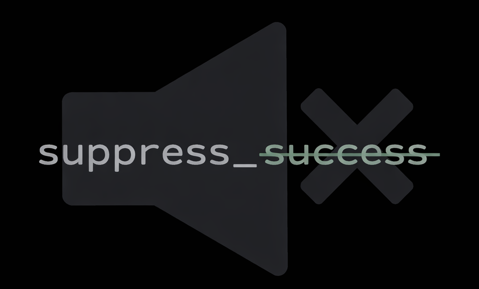

<p align="center">
  
</p>

<h1 align="center">suppress_success</h1>

<p align="center"><em>Noise-free by design.</em></p>

<p align="center">A CLI that suppresses output on success. On failure, it prints the full output for debugging and returns the original exit code.</p>

[](https://github.com/isidore/SuppressSuccess/actions/workflows/build.yml)

## Installation

Download the latest binary from [GitHub Releases](https://github.com/lexler/suppress_success/releases).

```bash
# Mac Apple Silicon
curl -L https://github.com/lexler/suppress_success/releases/latest/download/suppress_success-mac-apple-silicon -o suppress_success
chmod +x suppress_success
mv suppress_success /usr/local/bin/
```

```bash
# Mac Intel
curl -L https://github.com/lexler/suppress_success/releases/latest/download/suppress_success-mac-intel -o suppress_success
chmod +x suppress_success
mv suppress_success /usr/local/bin/
```

```powershell
# Windows
curl -L https://github.com/lexler/suppress_success/releases/latest/download/suppress_success-windows.exe -o suppress_success.exe
```

## Quick start

```bash
suppress_success echo "Hello"                    # prints "Success"
suppress_success --message "Hi" echo "Hello"     # prints "Hi"
suppress_success sh -c 'echo "Hello" && exit 1'  # prints "Hello", exits 1
```


## Usage

See the [User Guide](docs/guide.md) for full documentation.
